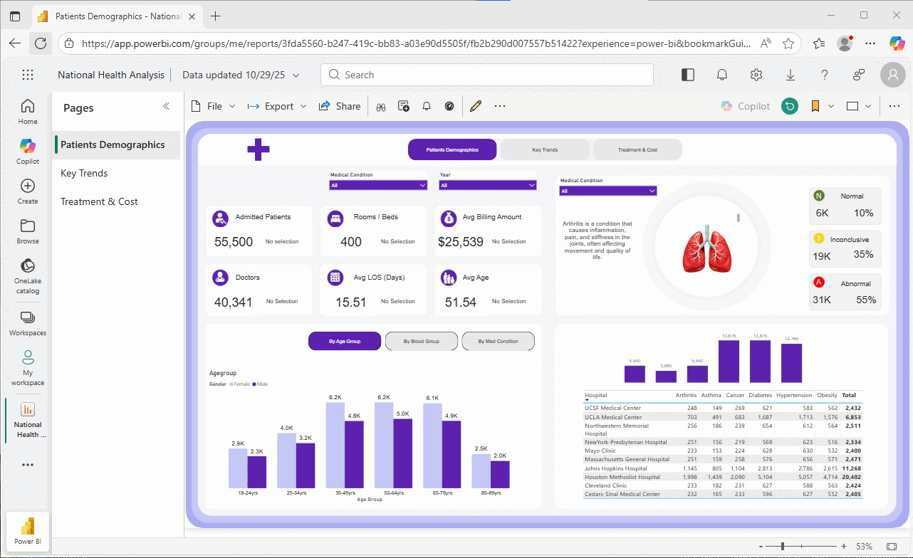

# Power BI Healthcare Data Analysis

A healthcare data visualization project demonstrating Power BI capabilities and data analysis techniques.

## Project Overview

This project analyzes national healthcare data using Power BI, with three interactive dashboard pages covering patient demographics, trends, and financial metrics. The project demonstrates the complete data workflow from raw Excel data through Power Query transformation to interactive visualizations.

## Dashboard Preview

## Data Workflow

### 1. Data Source
The project uses `Healthcare Analysis Dataset.xlsx` containing patient records with information about:
- Patient demographics (age, gender, blood type)
- Medical conditions and admission details
- Treatment information and billing data
- Hospital and doctor assignments

### 2. Power Query Transformation
The Excel data is imported into Power BI Desktop and processed through Power Query:
- Data cleaning and type conversions
- Column renaming for clarity
- Filtering null or invalid records
- Creating calculated columns for age groups and categorizations
- Setting up proper date formats for time-based analysis

### 3. Data Modeling
After transformation, relationships are established:
- Primary key relationships between tables (if multiple tables)
- Date table creation for time intelligence
- Calculated columns for segmentation
- Optimized data types for performance

### 4. DAX Measures
Custom measures are created for analysis:
- Total Patients count
- Average Age calculations
- Average Length of Stay (LOS)
- Total Billing Amount aggregations
- Conditional measures for filtered views
- KPIs for abnormal and normal results

### 5. Visualizations Across Three Pages

**Page 1: Patient Demographics**
- KPI cards showing total patients (55,500), rooms (400), billing amount ($25.5M), and doctors (40,341)
- Demographic breakdown by age groups, blood type, and medical conditions
- Interactive bookmark navigation for switching between demographic views
- Bar charts showing average age and LOS by different demographic segments
- Condition-specific analysis with visual indicators

**Page 2: Key Trends**
- Time-based trend analysis of healthcare metrics
- Admission patterns and seasonal variations
- Length of Stay (LOS) trends across different periods
- Comparative analysis between medical conditions
- Interactive filters for drilling down into specific timeframes

**Page 3: Treatment & Cost Analysis**
- Financial metrics showing billing distribution
- Treatment cost analysis by condition and medication
- Resource utilization tracking (doctors, rooms)
- Cost efficiency indicators
- Correlation between treatment types and outcomes

## Project Files

- `Healthcare Analysis Dataset.xlsx` - Source healthcare data
- `National Health Analysis.pbix` - Power BI dashboard (3 interactive pages)
- `Screenshots/` - Dashboard visualizations

## Power BI Features Demonstrated

- Data Import & Transformation using Power Query
- Data Modeling with relationships and calculated columns
- DAX Measures for custom calculations and KPIs
- Interactive Visualizations including charts, bar graphs, and KPI cards
- Bookmark Navigation for page switching
- Filters & Slicers for dynamic data filtering
- Multi-Page Dashboard layout with organized insights

## How to View

### Option 1: Download and Explore Locally

1. Download `National Health Analysis.pbix` from this repo
2. Install [Power BI Desktop](https://powerbi.microsoft.com/desktop/) (free)
3. Open the file and interact with filters, slicers, and drill-through features

### Option 2: View Screenshots

Browse the Screenshots folder above to see all dashboard pages.

## Key Insights

- Patient Demographics: Age groups, blood types, medical conditions distribution
- Healthcare Trends: Admission patterns, LOS analysis, condition-based metrics
- Financial Analysis: Billing amounts, treatment costs, and resource utilization

## Technical Skills

- Power Query (ETL)
- Data Modeling & Relationships
- DAX (Data Analysis Expressions)
- Custom Visualizations
- Interactive Dashboards
- Bookmark Navigation
- KPI Development
