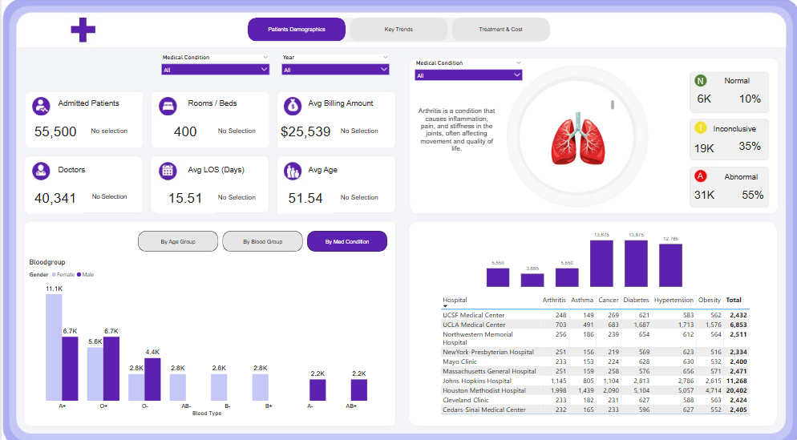
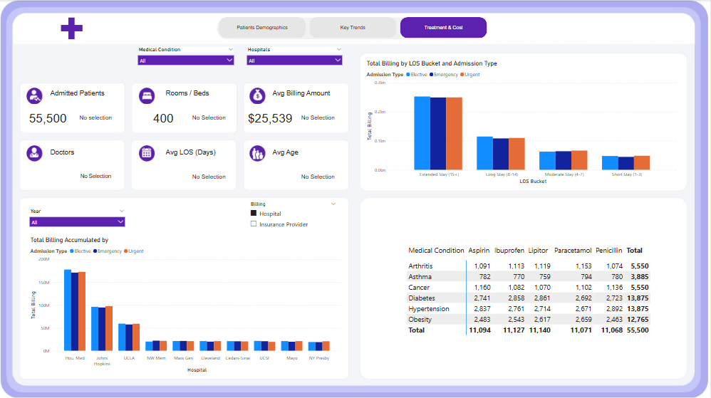
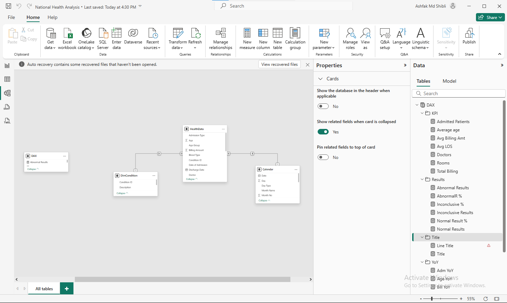

# Power BI Healthcare Data Analysis

A comprehensive healthcare data visualization project demonstrating Power BI skills and essential features.

## 📊 Project Overview
This project analyzes national healthcare data using Power BI, showcasing key visualization capabilities and data analysis techniques across three interactive dashboard pages.

## �️ Dashboard Preview

### Patients Demographics

### Key Trends Analysis

### Treatment & Cost Analysis

### DAX Measures

## �🗂️ Project Files
- `Healthcare Analysis Dataset.xlsx` - Source healthcare data
- `National Health Analysis.pbix` - Power BI dashboard (3 interactive pages)
- `Screenshots/` - Dashboard visualizations

## 🎯 Power BI Features Demonstrated
- **Data Import & Transformation** - Power Query for data cleaning and shaping
- **Data Modeling** - Relationships and calculated columns
- **DAX Measures** - Custom calculations, aggregations, and KPIs
- **Interactive Visualizations** - Charts, bar graphs, KPI cards, and custom visuals
- **Bookmark Navigation** - Page navigation and view switching
- **Filters & Slicers** - Dynamic data filtering across demographics
- **Multi-Page Dashboards** - Organized insights across 3 pages
  - Page 1: Patient Demographics
  - Page 2: Key Trends
  - Page 3: Treatment & Cost Analysis

## 🚀 How to View

### Option 1: Download & Open (Full Interactivity)
1. Download `National Health Analysis.pbix`
2. Open with [Power BI Desktop](https://powerbi.microsoft.com/desktop/) (free)
3. Interact with filters, slicers, and drill-through features

### Option 2: View Screenshots
Browse the `Screenshots/` folder for static previews of all dashboard pages

### Option 3: Power BI Service (Live Link)
*Coming soon - Dashboard will be published to Power BI Service for live interactive viewing*

## 📈 Key Insights
- **Patient Demographics** - Age groups, blood types, medical conditions distribution
- **Healthcare Trends** - Admission patterns, LOS analysis, condition-based metrics
- **Financial Analysis** - Billing amounts, treatment costs, and resource utilization

## 🛠️ Technical Skills Showcased
✅ Power Query (ETL)  
✅ Data Modeling & Relationships  
✅ DAX (Data Analysis Expressions)  
✅ Custom Visualizations  
✅ Interactive Dashboards  
✅ Bookmark Navigation  
✅ KPI Development  

---
*Project created to demonstrate Power BI proficiency and data visualization skills for portfolio showcase*
